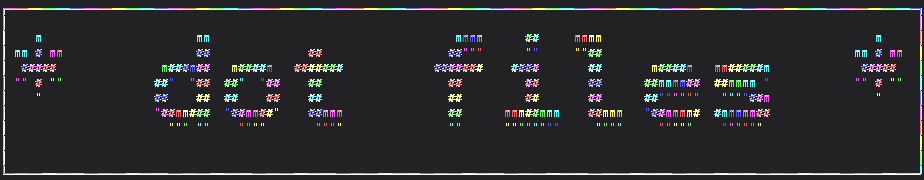

```
 _________________________________________
/ Dojo, YUI, ExtJS, jQuery UI, Ember,     \
| Cappuccino, SproutCore, GWT, Angular,   |
| Angular 1.2, Angular 1.3, Angular 2,    |
| NOT-Angular 3 but Angular 4, Sencha,    |
| jQuery Mobile, Knockout, Meteor,        |
| Ampersand, Flight, Mithril, Polymer,    |
| React and Flux but dont forget          |
| ActionScript, AtScript, CoffeeScript,   |
| Dart, JScript, LiveScript, Objective-J, |
| Elm, JSX, JSweet and Closure Compiler.  |
| All fixed bad coders - Guaranteed™!     |
|                                         |
\ ~ Colin C, emacs user                	  /
 -----------------------------------------
  \
   \   \_\_    _/_/
    \      \__/
           (oo)\_______
           (__)\       )\/\
               ||----w |
               ||     ||
```

  
A repository of dotfiles and tools managed by GNU STOW, version controlled by git, and maintained by me. 💻💖


```
 git            		> global git config and aliases
 zsh           			> shell settings, aliases, and configs
 iterm2         		> default profile preferences
 cowsay					> critically important .cowfiles
```


### dependencies - get 'em! ###

- homebrew
- rvm
- gem
- zsh
- fzf
- nerd fonts
- spaceship prompt
- cowsay


[Gnu Stow](http://www.gnu.org/software/stow/manual/stow.html)
-------------------------------------------------------------
The current directory (~/dot) is where stow commands are issued, and the target directory is assumed to be the parent of the current directory (~/). Each package given on the command line is the name of a package in the stow directory (e.g., emacs).  
How to operate stow:

navigate to your home directory

`cd ~`

enter the dotfiles directory

`cd dot`

install the bash settings

`stow bash`

uninstall bash settings

`stow -D bash`

rescan package for new files

`stow -R bash`